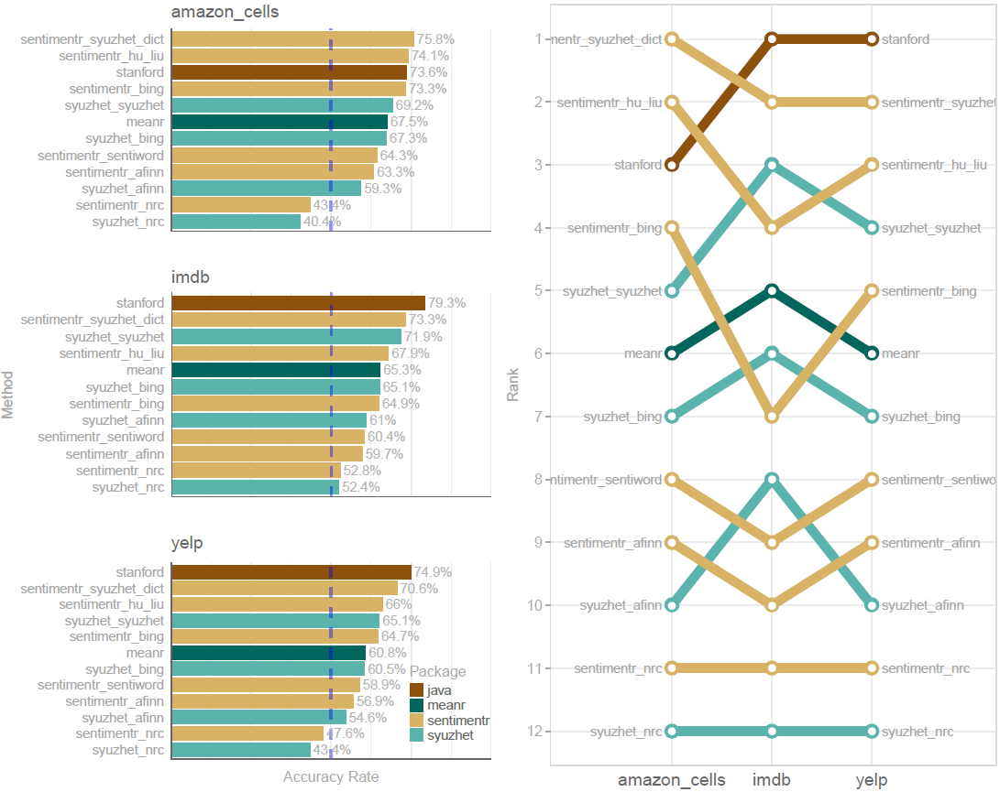
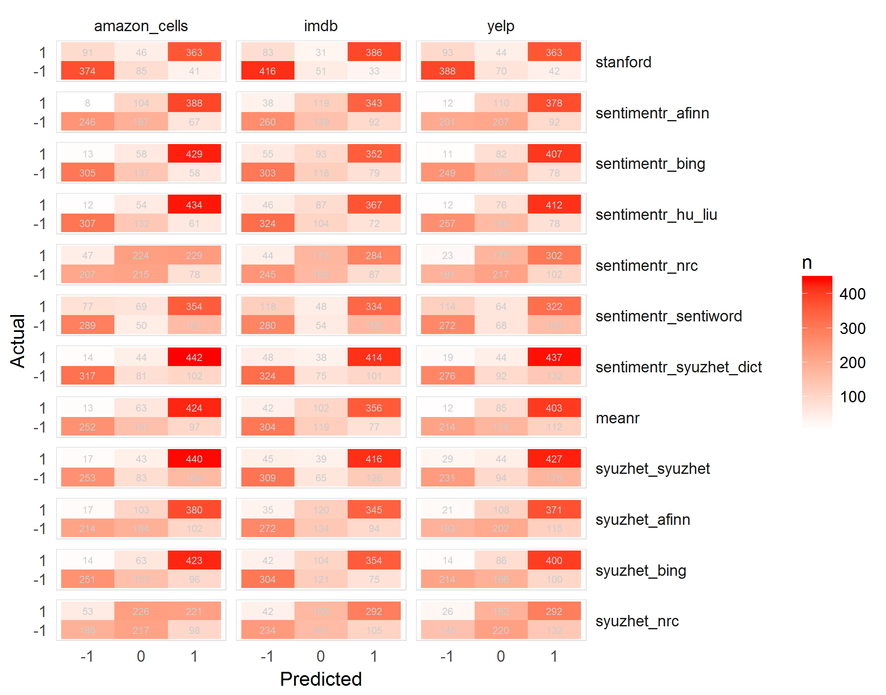
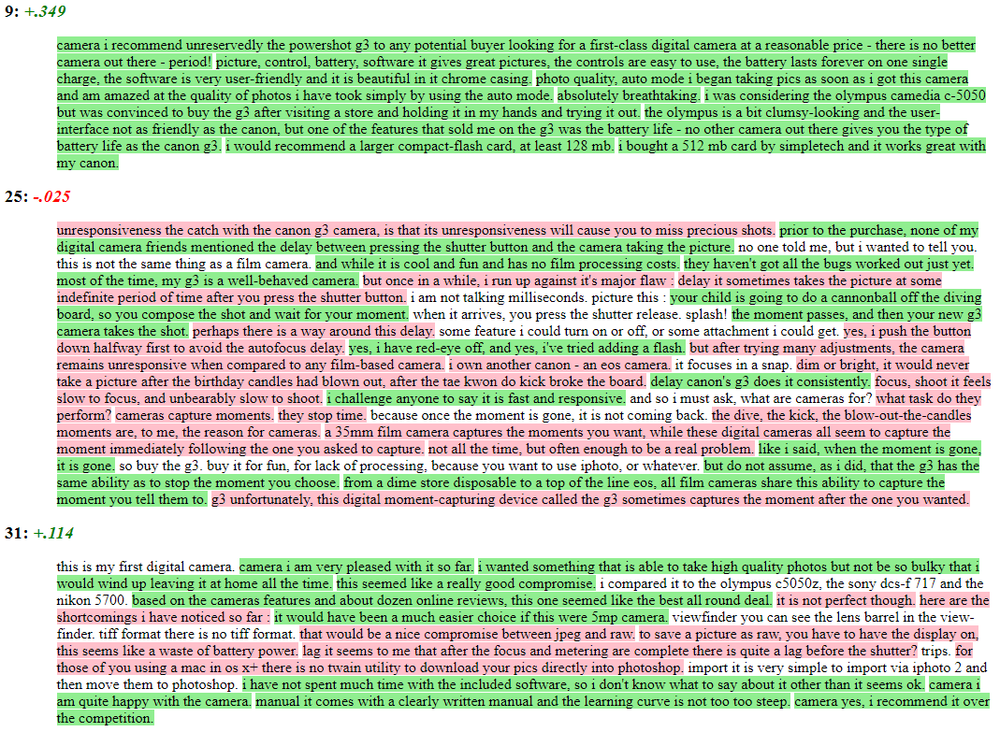

```{r, echo=FALSE}
desc <- suppressWarnings(readLines("DESCRIPTION"))
regex <- "(^Version:\\s+)(\\d+\\.\\d+\\.\\d+)"
loc <- grep(regex, desc)
ver <- gsub(regex, "\\2", desc[loc])
verbadge <- sprintf('<a href="https://img.shields.io/badge/Version-%s-orange.svg"></a></p>', ver, ver)
verbadge <- ''
````


```{r, echo=FALSE, message=FALSE, warning=FALSE}
library(knitr)
library(pander)
library(dplyr)
options(scipen=999)
knit_hooks$set(htmlcap = function(before, options, envir) {
  if(!before) {
    paste('<p class="caption"><b><em>',options$htmlcap,"</em></b></p>",sep="")
    }
    })
knitr::opts_knit$set(self.contained = TRUE, cache = FALSE)
knitr::opts_chunk$set(fig.path = "tools/figure/")
```

[](http://www.repostatus.org/#active)
[](https://travis-ci.org/trinker/sentimentr)
[](https://coveralls.io/r/trinker/sentimentr?branch=master)
[](https://zenodo.org/badge/latestdoi/5398/trinker/sentimentr)
[](https://cran.r-project.org/package=sentimentr)
`r verbadge`


**sentimentr** is designed to quickly calculate text polarity sentiment at the sentence level and optionally aggregate by rows or grouping variable(s).

**sentimentr** is a response to my own needs with sentiment detection that were not addressed by the current **R** tools.  My own `polarity` function in the **qdap** package is slower on larger data sets.  It is a dictionary lookup approach that tries to incorporate weighting for valence shifters (negation and amplifiers/deamplifiers).  Matthew Jocker's created the [**syuzhet** ](http://www.matthewjockers.net/2015/02/02/syuzhet/) package that utilizes dictionary lookups for the Bing, NRC, and Afinn methods as well as a custom dictionary.  He also utilizes a wrapper for the [Stanford coreNLP](http://nlp.stanford.edu/software/corenlp.shtml) which uses much more sophisticated analysis.  Jocker's dictionary methods are fast but are more prone to error in the case of valence shifters.  Jocker's [addressed these critiques](http://www.matthewjockers.net/2015/03/04/some-thoughts-on-annies-thoughts-about-syuzhet/) explaining that the method is good with regard to analyzing general sentiment in a piece of literature.  He points to the accuracy of the Stanford detection as well.  In my own work I need better accuracy than a simple dictionary lookup; something that considers valence shifters yet optimizes speed which the Stanford's parser does not.  This leads to a trade off of speed vs. accuracy.  Simply, **sentimentr** attempts to balance accuracy and speed.

# Why sentimentr

***So what does*** **sentimentr** ***do that other packages don't and why does it matter?***  

> **sentimentr** attempts to take into account valence shifters (i.e., negators, amplifiers (intensifiers), de-amplifiers (downtoners), and adversative conjunctions) while maintaining speed.  Simply put, **sentimentr** is an augmented dictionary lookup.  The next questions address why it matters.        

***So what are these valence shifters?***  

> A *negator* flips the sign of a polarized word (e.g., "I do ***not*** like it.").  See `lexicon::hash_valence_shifters[y==1]` for examples.  An *amplifier* (intensifier) increases the impact of a polarized word (e.g., "I ***really*** like it.").  See `lexicon::hash_valence_shifters[y==2]` for examples.  A *de-amplifier* (downtoner) reduces the impact of a polarized word (e.g., "I ***hardly*** like it.").  See `lexicon::hash_valence_shifters[y==3]` for examples.  An *adversative conjunction* overrules the previous clause containing a polarized word (e.g., "I like it ***but*** it's not worth it.").  See `lexicon::hash_valence_shifters[y==4]` for examples.     

***Do valence shifters really matter?***

> Well valence shifters affect the polarized words.  In the case of *negators* and *adversative conjunctions* the entire sentiment of the clause may be reversed or overruled.  So if valence shifters occur fairly frequently a simple dictionary lookup may not be modeling the sentiment appropriately.  You may be wondering how frequently these valence shifters co-occur with polarized words, potentially changing, or even reversing and overruling the clause's sentiment.  The table below shows the rate of sentence level co-occurrence of valence shifters with polarized words across a few types of texts. 

```{r, echo=FALSE, results='asis'}
val_tab <- readRDS(system.file("the_case_for_sentimentr/attributes_rate.rds", package = "sentimentr"))
val_tab %>%
    setNames(gsub("(^.)(.*)", "\\U\\1\\L\\2", names(.), perl=TRUE)) %>%
    pandoc.table(justify = c('left', rep('right', 4)), style='rmarkdown', split.tables=Inf)
```


Indeed *negators* appear ~20% of the time a polarized word appears in a sentence.  Conversely, *adversative conjunctions* appear with polarized words ~10% of the time.  Not accounting for the valence shifters could significantly impact the modeling of the text sentiment.

The [script to replicate the frequency analysis](https://raw.githubusercontent.com/trinker/sentimentr/master/inst/the_case_for_sentimentr/valence_shifter_cooccurrence_rate.R), shown in the table above, can be accessed via:

```{r, eval=FALSE}
val_shift_freq <- system.file("the_case_for_sentimentr/valence_shifter_cooccurrence_rate.R", package = "sentimentr")
file.copy(val_shift_freq, getwd())
```

# Functions

There are two main functions (top 2 in table below) in **sentimentr** with several helper functions summarized in the table below:


| Function         |  Description                                          |
|------------------|-------------------------------------------------------|
| `sentiment`      | Sentiment at the sentence level                       |
| `sentiment_by`   | Aggregated sentiment by group(s)                      |
| `uncombine`      | Extract sentence level sentiment from  `sentiment_by` |
| `get_sentences`  | Regex based string to sentence parser (or get sentences from `sentiment`/`sentiment_by`)|
| `replace_emoji`           | repalcement | Replace emojis with word equivalent or unique identifier |
| `replace_emoticon`| Replace emoticons with word equivalent               |
| `replace_grade`  | Replace grades (e.g., "A+") with word equivalent     |
| `replace_internet_slang`  | replacment  | Replace Internet slang with word equivalents |
| `replace_rating` | Replace ratings (e.g., "10 out of 10", "3 stars") with word equivalent |
| `as_key`         | Coerce a `data.frame` lexicon to a polarity hash key  |
| `is_key`         | Check if an object is a hash key                      |
| `update_key`     | Add/remove terms to/from a hash key                   |
| `highlight`      | Highlight positive/negative sentences as an HTML document |
| `general_rescale` | Generalized rescaling function to rescale sentiment scoring |
| `sentiment_attribute` | Extract the sentiment based attributes from a text |
| `validate_sentiment` | Validate sentiment score sign against known results |


# The Equation 

The equation below describes the augmented dictionary method of **sentimentr** that may give better results than a simple lookup dictionary approach that does not consider valence shifters.  The equation used by the algorithm to assign value to polarity of each sentence fist utilizes a sentiment dictionary (e.g., Jockers, [(2017)](https://github.com/mjockers/syuzhet)) to tag polarized words.  Each paragraph ($p_i = \{s_1, s_2, ..., s_n\}$) composed of sentences, is broken into element sentences ($s_i,j = \{w_1, w_2, ..., w_n\}$) where $w$ are the words within sentences.  Each sentence ($s_j$) is broken into a an ordered bag of words.  Punctuation is removed with the exception of pause punctuations (commas, colons, semicolons) which are considered a word within the sentence.  I will denote pause words as $cw$ (comma words) for convenience.  We can represent these words as an i,j,k notation as $w_{i,j,k}$.  For example $w_{3,2,5}$ would be the fifth word of the second sentence of the third paragraph.  While I use the term paragraph this merely represent a complete turn of talk.  For example it may be a cell level response in a questionnaire composed of sentences.

The words in each sentence ($w_{i,j,k}$) are searched and compared to a dictionary of polarized words (e.g., a combined and augmented version of Jocker's (2017) [originally exported by the [**syuzhet**](https://github.com/mjockers/syuzhet) package] & Rinker's augmented Hu & Liu (2004) dictionaries in the [**lexicon**](https://cran.r-project.org/package=lexicon) package). Positive ($w_{i,j,k}^{+}$) and negative ($w_{i,j,k}^{-}$) words are tagged with a $+1$ and $-1$ respectively (or other positive/negative weighting if the user provides the sentiment dictionary).  I will denote polarized words as $pw$ for convenience. These will form a polar cluster ($c_{i,j,l}$) which is a subset of the a sentence ($c_{i,j,l} \subseteq s_i,j$).

The polarized context cluster ($c_{i,j,l}$) of words is pulled from around the polarized word ($pw$) and defaults to 4 words before and two words after $pw$ to be considered as valence shifters.  The cluster can be represented as ($c_{i,j,l} = \{pw_{i,j,k - nb}, ..., pw_{i,j,k} , ..., pw_{i,j,k - na}\}$), where $nb$ & $na$ are the parameters `n.before` and `n.after` set by the user.  The words in this polarized context cluster are tagged as neutral ($w_{i,j,k}^{0}$), negator ($w_{i,j,k}^{n}$),
amplifier [intensifier] ($w_{i,j,k}^{a}$), or de-amplifier [downtoner] ($w_{i,j,k}^{d}$). Neutral words hold no value in the equation but do affect word count ($n$).  Each polarized word is then weighted ($w$) based on the weights from the `polarity_dt` argument and then further weighted by the function and number of the valence shifters directly surrounding the positive or negative word ($pw$).  Pause ($cw$) locations (punctuation that denotes a pause including commas, colons, and semicolons) are indexed and considered in calculating the upper and lower bounds in the polarized context cluster. This is because these marks indicate a change in thought and words prior are not necessarily connected with words after these punctuation marks.  The lower bound of the polarized context cluster is constrained to $\max \{pw_{i,j,k - nb}, 1, \max \{cw_{i,j,k} < pw_{i,j,k}\}\}$ and the upper bound is constrained to $\min \{pw_{i,j,k + na}, w_{i,jn}, \min \{cw_{i,j,k} > pw_{i,j,k}\}\}$ where $w_{i,jn}$ is the number of words in the sentence.

The core value in the cluster, the polarized word is acted upon by valence shifters. Amplifiers increase the polarity by 1.8 (.8 is the default weight ($z$)).  Amplifiers ($w_{i,j,k}^{a}$) become de-amplifiers if the context cluster contains an odd number of negators ($w_{i,j,k}^{n}$).  De-amplifiers work to decrease the polarity.  Negation ($w_{i,j,k}^{n}$) acts on amplifiers/de-amplifiers as discussed but also flip the sign of the polarized word.  Negation is determined by raising $-1$ to the power of the number of negators ($w_{i,j,k}^{n}$) plus $2$.  Simply, this is a result of a belief that two negatives equal a positive, 3 negatives a negative, and so on.

The adversative conjunctions (i.e., 'but', 'however', and 'although') also weight the context cluster.  An adversative conjunction before the polarized word ($w_{adversative\,conjunction}, ..., w_{i, j, k}^{p}$) up-weights the cluster by 1 + $z_2 * \{|w_{adversative\,conjunction}|, ..., w_{i, j, k}^{p}\}$ (.85 is the default weight ($z_2$) where $|w_{adversative\,conjunction}|$ are the number of adversative conjunctions before the polarized word).  A adversative conjunction after the polarized word down-weights the cluster by 1 + $\{w_{i, j, k}^{p}, ..., |w_{adversative\,conjunction}| * -1\} * z_2$.  This corresponds to the belief that an adversative conjunction makes the next clause of greater values while lowering the value placed on the prior clause.

The researcher may provide a weight ($z$) to be utilized with amplifiers/de-amplifiers (default is $.8$; de-amplifier weight is constrained to $-1$ lower bound).  Last, these weighted context clusters ($c_{i,j,l}$) are summed ($c'_{i,j}$) and divided by the square root of the word count (&radic;$w_{i,jn}$) yielding an unbounded polarity score ($\delta_{i,j}$) for each sentence.


$\delta$<sub>*i**j*</sub> = <em>c</em>'<sub>*i**j*</sub>/&radic;*w*<sub>*i**j**n*</sub>


Where:

$$c'_{i,j} = \sum{((1 + w_{amp} + w_{deamp})\cdot w_{i,j,k}^{p}(-1)^{2 + w_{neg}})}$$

$$w_{amp} = \sum{(w_{neg}\cdot (z \cdot w_{i,j,k}^{a}))}$$

$$w_{deamp} = \max(w_{deamp'}, -1)$$

$$w_{deamp'} = \sum{(z(- w_{neg}\cdot w_{i,j,k}^{a} + w_{i,j,k}^{d}))}$$


$$w_{b} = 1 + z_2 * w_{b'}$$

$$w_{b'} = \sum{(|w_{adversative\,conjunction}|, ..., w_{i, j, k}^{p}, w_{i, j, k}^{p}, ..., |w_{adversative\,conjunction}| * -1})$$

$w_{neg}$ = ($\sum{w_{i,j,k}^{n}}$ ) mod 2

To get the mean of all sentences ($s_{i,j}$) within a paragraph/turn of talk ($p_{i}$) simply take the average sentiment score $p_{i,\delta_{i,j}}$ = 1/n $\cdot$ $\sum$ $\delta_{i,j}$ or use an available weighted average (the default `average_weighted_mixed_sentiment` which upweights the negative values in a vector while also downweighting the zeros in a vector or `average_downweighted_zero` which simply downweights the zero polarity scores).

# Installation

To download the development version of **sentimentr**:

Download the [zip ball](https://github.com/trinker/sentimentr/zipball/master) or [tar ball](https://github.com/trinker/sentimentr/tarball/master), decompress and run `R CMD INSTALL` on it, or use the **pacman** package to install the development version:

```r
if (!require("pacman")) install.packages("pacman")
pacman::p_load_current_gh("trinker/lexicon", "trinker/sentimentr")
```

# Examples

```{r}
if (!require("pacman")) install.packages("pacman")
pacman::p_load(sentimentr, dplyr, magrittr)
```

## Preferred Workflow
Here is a basic `sentiment` demo.  Notice that the first thing you should do is to split your text data into sentences (a process called sentence boundary disambiguation) via the `get_sentences` function.  This can be handled within `sentiment` (i.e., you can pass a raw character vector) but it slows the function down and should be done one time rather than every time the function is called.  Additionally, a warning will be thrown if a larger raw character vector is passed.  The preferred workflow is to spit the text into sentences with `get_sentences` before any sentiment analysis is done.  


```{r}
mytext <- c(
    'do you like it?  But I hate really bad dogs',
    'I am the best friend.',
    'Do you really like it?  I\'m not a fan'
)

mytext <- get_sentences(mytext)
sentiment(mytext)
```

To aggregate by element (column cell or vector element) use `sentiment_by` with `by = NULL`.

```{r}
mytext <- c(
    'do you like it?  But I hate really bad dogs',
    'I am the best friend.',
    'Do you really like it?  I\'m not a fan'
)
mytext <- get_sentences(mytext)
sentiment_by(mytext)
```

To aggregate by grouping variables use `sentiment_by` using the `by` argument.

```{r}
(out <- with(
    presidential_debates_2012, 
    sentiment_by(
        get_sentences(dialogue), 
        list(person, time)
    )
))
```

## Tidy Approach

Or if you prefer a more tidy approach:

```{r}
library(magrittr)
library(dplyr)

presidential_debates_2012 %>%
    dplyr::mutate(dialogue_split = get_sentences(dialogue)) %$%
    sentiment_by(dialogue_split, list(person, time))
```

Note that you can skip the `dplyr::mutate` step by using `get_sentences` on a `data.frame` as seen below:

```{r}
presidential_debates_2012 %>%
    get_sentences() %$%
    sentiment_by(dialogue, list(person, time))
```

## Plotting 

### Plotting at Aggregated Sentiment

```{r, warning=FALSE}
plot(out)
```


### Plotting at the Sentence Level

The `plot` method for the class `sentiment` uses **syuzhet**'s `get_transformed_values` combined with **ggplot2** to make a reasonable, smoothed plot for the duration of the text based on percentage, allowing for comparison between plots of different texts.  This plot gives the overall shape of the text's sentiment.  The user can see `syuzhet::get_transformed_values` for more details.

```{r}
plot(uncombine(out))
```

## Making and Updating Dictionaries

It is pretty straight forward to make or update a new dictionary (polarity or valence shifter).  To create a key from scratch the user needs to create a 2 column `data.frame`, with words on the left and values on the right (see `?lexicon::hash_sentiment_jockers_rinker` & `?lexicon::hash_valence_shifters` for what the values mean).  Note that the words need to be lower cased.  Here I show an example `data.frame` ready for key conversion:

```{r}
set.seed(10)
key <- data.frame(
    words = sample(letters),
    polarity = rnorm(26),
    stringsAsFactors = FALSE
)
```

This is not yet a key.  **sentimentr** provides the `is_key` function to test if a table is a key.

```{r}
is_key(key)
```

It still needs to be **data.table**-ified.  The `as_key` function coerces a `data.frame` to a **data.table** with the left column named `x` and the right column named `y`.  It also checks the key against another key to make sure there is not overlap using the `compare` argument.  By default `as_key` checks against `valence_shifters_table`, assuming the user is creating a sentiment dictionary.  If the user is creating a valence shifter key then a sentiment key needs to be passed to `compare` instead and set the argument `sentiment = FALSE`.  Below I coerce `key` to a dictionary that **sentimentr** can use.


```{r}
mykey <- as_key(key)
```

Now we can check that `mykey` is a usable dictionary:

```{r}
is_key(mykey)
```

The key is ready for use:

```{r}
sentiment_by("I am a human.", polarity_dt = mykey)
```


You can see the values of a key that correspond to a word using **data.table** syntax:

```{r}
mykey[c("a", "b")][[2]]
```

Updating (adding or removing terms) a key is also useful.  The `update_key` function allows the user to add or drop terms via the `x` (add a `data.frame`) and `drop` (drop a term) arguments.  Below I drop the "a" and "h" terms (notice there are now 24 rows rather than 26):

```{r}
mykey_dropped <- update_key(mykey, drop = c("a", "h"))
nrow(mykey_dropped)
sentiment_by("I am a human.", polarity_dt = mykey_dropped)
```

Next I add the terms "dog" and "cat" as a `data.frame` with sentiment values:

```{r}
mykey_added <- update_key(mykey, x = data.frame(x = c("dog", "cat"), y = c(1, -1)))
nrow(mykey_added)
sentiment("I am a human. The dog.  The cat", polarity_dt = mykey_added)
```

## Annie Swafford's Examples

[Annie Swafford](https://annieswafford.wordpress.com/2015/03/02/syuzhet/) critiqued Jocker's approach to sentiment and gave the following examples of sentences (`ase` for Annie Swafford example).  Here I test each of Jocker's 4 dictionary approaches (syuzhet, Bing, NRC, Afinn), his Stanford wrapper (note I use my own [GitHub Stanford wrapper package](https://github.com/trinker/stansent) based off of Jocker's approach as it works more reliably on  my own Windows machine), the [RSentiment](https://cran.r-project.org/package=RSentiment) package, the lookup based [SentimentAnalysis](https://github.com/sfeuerriegel/SentimentAnalysis) package, the [meanr](https://github.com/wrathematics/meanr) package (written in C level code), and my own algorithm with default combined Jockers (2017) & Rinker's Hu & Liue (2004) polarity lexicons as well as Hu & Liu (2004) and [Baccianella, Esuli and Sebastiani's (2010)](http://sentiwordnet.isti.cnr.it/) SentiWord lexicons available from the [**lexicon**](https://github.com/trinker/lexicon) package.


```{r, message=FALSE, comment=NA}
if (!require("pacman")) install.packages("pacman")
pacman::p_load_gh("trinker/sentimentr", "trinker/stansent", "sfeuerriegel/SentimentAnalysis", "wrathematics/meanr")
pacman::p_load(syuzhet, qdap, microbenchmark, RSentiment)

ase <- c(
    "I haven't been sad in a long time.",
    "I am extremely happy today.",
    "It's a good day.",
    "But suddenly I'm only a little bit happy.",
    "Then I'm not happy at all.",
    "In fact, I am now the least happy person on the planet.",
    "There is no happiness left in me.",
    "Wait, it's returned!",
    "I don't feel so bad after all!"
)

syuzhet <- setNames(as.data.frame(lapply(c("syuzhet", "bing", "afinn", "nrc"),
    function(x) get_sentiment(ase, method=x))), c("jockers", "bing", "afinn", "nrc"))

SentimentAnalysis <- apply(analyzeSentiment(ase)[c('SentimentGI', 'SentimentLM', 'SentimentQDAP') ], 2, round, 2)
colnames(SentimentAnalysis) <- gsub('^Sentiment', "SA_", colnames(SentimentAnalysis))

left_just(data.frame(
    stanford = sentiment_stanford(ase)[["sentiment"]],
    sentimentr_jockers_rinker = round(sentiment(ase, question.weight = 0)[["sentiment"]], 2),
    sentimentr_jockers = round(sentiment(ase, lexicon::hash_sentiment_jockers, question.weight = 0)[["sentiment"]], 2),    
    sentimentr_huliu = round(sentiment(ase, lexicon::hash_sentiment_huliu, question.weight = 0)[["sentiment"]], 2),    
    sentimentr_sentiword = round(sentiment(ase, lexicon::hash_sentiment_sentiword, question.weight = 0)[["sentiment"]], 2),    
    RSentiment = calculate_score(ase), 
    SentimentAnalysis,
    meanr = score(ase)[['score']],
    syuzhet,
    sentences = ase,
    stringsAsFactors = FALSE
), "sentences")

```

Also of interest is the computational time used by each of these methods. To demonstrate this I increased Annie's examples by 100 replications and **microbenchmark** on a few iterations (Stanford takes so long I didn't extend to more).  Note that if a text needs to be broken into sentence parts **syuzhet** has the `get_sentences` function that uses the **openNLP** package, this is a time expensive task. **sentimentr** uses a much faster regex based approach that is nearly as accurate in parsing sentences with a much lower computational time.  We see that **RSentiment** and Stanford take the longest time while **sentimentr** and **syuzhet** are comparable depending upon lexicon used.  **meanr** is lighting fast.  **SentimentAnalysis** is a bit slower than other methods but is returning 3 scores from 3 different dictionaries.  I do not test **RSentiment** because it causes an out of memory error.


```{r, message = FALSE, comment=NA}
ase_100 <- rep(ase, 100)
 
stanford <- function() {sentiment_stanford(ase_100)}

sentimentr_jockers_rinker <- function() sentiment(ase_100, lexicon::hash_sentiment_jockers_rinker)
sentimentr_jockers <- function() sentiment(ase_100, lexicon::hash_sentiment_jockers)
sentimentr_huliu <- function() sentiment(ase_100, lexicon::hash_sentiment_huliu)
sentimentr_sentiword <- function() sentiment(ase_100, lexicon::hash_sentiment_sentiword) 
    
RSentiment <- function() calculate_score(ase_100) 
    
SentimentAnalysis <- function() analyzeSentiment(ase_100)

meanr <- function() score(ase_100)

syuzhet_jockers <- function() get_sentiment(ase_100, method="syuzhet")
syuzhet_binn <- function() get_sentiment(ase_100, method="bing")
syuzhet_nrc <- function() get_sentiment(ase_100, method="nrc")
syuzhet_afinn <- function() get_sentiment(ase_100, method="afinn")
     
microbenchmark(
    stanford(),
    sentimentr_jockers_rinker(),
    sentimentr_jockers(),
    sentimentr_huliu(),
    sentimentr_sentiword(),
    #RSentiment(), 
    SentimentAnalysis(),
    syuzhet_jockers(),
    syuzhet_binn(), 
    syuzhet_nrc(),
    syuzhet_afinn(),
    meanr(),
    times = 3
)
```


## Comparing sentimentr, syuzhet, meanr, and Stanford

The accuracy of an algorithm weighs heavily into the decision as to what approach to take in sentiment detection. I have selected algorithms/packages that stand out as fast and/or accurate to perform benchmarking on actual data. Both **syuzhet** and **sentimentr** provide multiple dictionaries with a general algorithm to compute sentiment scores. **syuzhet** provides 4 approaches while **sentimentr** provides 2, but can be extended easily using the 4 dictionaries from the **syuzhet** package.  **meanr** is a very fast algorithm.  The follow visualization provides the accuracy of these approaches in comparison to Stanford's **Java** based implementation of sentiment detection.  The visualization is generated from testing on three reviews data sets from Kotzias, Denil, De Freitas, & Smyth (2015).  These authors utilized the three 1000 element data sets from:

- amazon.com
- imdb.com
- yelp.com

The data sets are hand scored as either positive or negative.  The testing here uses [Mean Directional Accuracy (MDA)](https://en.wikipedia.org/wiki/Mean_Directional_Accuracy_(MDA)) and merely matches the sign of the algorithm to the human coded output to determine accuracy rates.

- Kotzias, D., Denil, M., De Freitas, N., & Smyth,P. (2015). *From group to individual labels using deep features*. Proceedings of the 21th ACM SIGKDD International Conference on Knowledge Discovery and Data Mining. 597-606. http://mdenil.com/media/papers/2015-deep-multi-instance-learning.pdf




The bar graph on the left shows the accuracy rates for the various sentiment set-ups in the three review contexts.  The rank plot on the right shows how the rankings for the methods varied across the three review contexts.  

The take away here seems that, unsurprisingly, Stanford's algorithm consistently outscores **sentimentr**, **syuzhet**, and **meanr**.  The **sentimentr** approach loaded with the Jockers' custom **syuzhet** dictionary is a top pick for speed and accuracy.  In addition to Jockers' custom dictionary the `bing` dictionary also performs well within both the **syuzhet** and **sentimentr** algorithms.  Generally, the **sentimentr** algorithm out performs **syuzhet** when their dictionaries are comparable.

It is important to point out that this is a small sample data set that covers a narrow range of uses for sentiment detection.  Jockers' **syuzhet** was designed to be applied across book chunks and it is, to some extent, unfair to test it out of this context.  Still this initial analysis provides a guide that may be of use for selecting the sentiment detection set up most applicable to the reader's needs.

The reader may access the R script used to generate this visual via:

```{r, eval=FALSE}
testing <- system.file("sentiment_testing/sentiment_testing.R", package = "sentimentr")
file.copy(testing, getwd())
```

In the figure below we compare raw table counts as a heat map, plotting the predicted values from the various algorithms on the x axis versus the human scored values on the y axis.  




Across all three contexts, notice that the Stanford coreNLP algorithm is better at:

- Detecting negative sentiment as negative
- Discrimination (i.e., reducing neutral assignments)

The Jockers, Bing, Hu & Lu, and Afinn dictionaries all do well with regard to not assigning negative scores to positive statements, but perform less well in the reverse, often assigning positive scores to negative statements, though Jockers' dictionary outperforms the others.  We can now see that the reason for the NRC's poorer performance in accuracy rate above is its inability to discriminate.  The Sentiword dictionary does well at discriminating (like Stanford's coreNLP) but lacks accuracy.  We can deduce two things from this observation:

1. Larger dictionaries discriminate better (Sentiword [n = `r  prettyNum(nrow(lexicon::hash_sentiment_sentiword), big.mark=",")`] vs. Hu & Lu [n = `r prettyNum(nrow(lexicon::hash_sentiment_huliu), big.mark=",")`])
2. The Sentiword dictionary may have words with reversed polarities

A reworking of the Sentiword dictionary may yield better results for a dictionary lookup approach to sentiment detection, potentially, improving on discrimination and accuracy.

The reader may access the R script used to generate this visual via:

```{r, eval=FALSE}
testing2 <- system.file("sentiment_testing/raw_results.R", package = "sentimentr")
file.copy(testing2, getwd())
```

## Text Highlighting

The user may wish to see the output from `sentiment_by` line by line with positive/negative sentences highlighted.  The `highlight` function wraps a `sentiment_by` output to produces a highlighted HTML file (positive = green; negative = pink). Here we look at three random reviews from Hu and Liu's (2004) Cannon G3 Camera Amazon product reviews.  

```{r, eval=FALSE}
library(magritrr)
library(dplyr)
set.seed(2)

cannon_reviews %>%
    filter(number %in% sample(unique(number), 3)) %>%
    mutate(review = get_sentences(review)) %$%
    sentiment_by(review, number) %>%
    highlight()
```



# Contact

You are welcome to:
* submit suggestions and bug-reports at: <https://github.com/trinker/sentimentr/issues>
* send a pull request on: <https://github.com/trinker/sentimentr/>
* compose a friendly e-mail to: <tyler.rinker@gmail.com>
