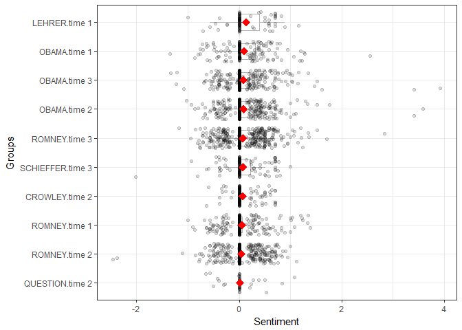
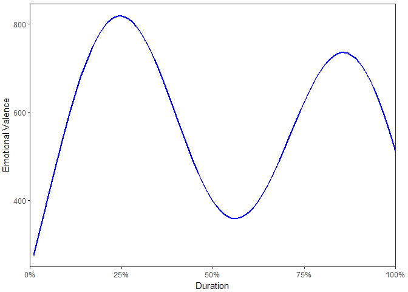
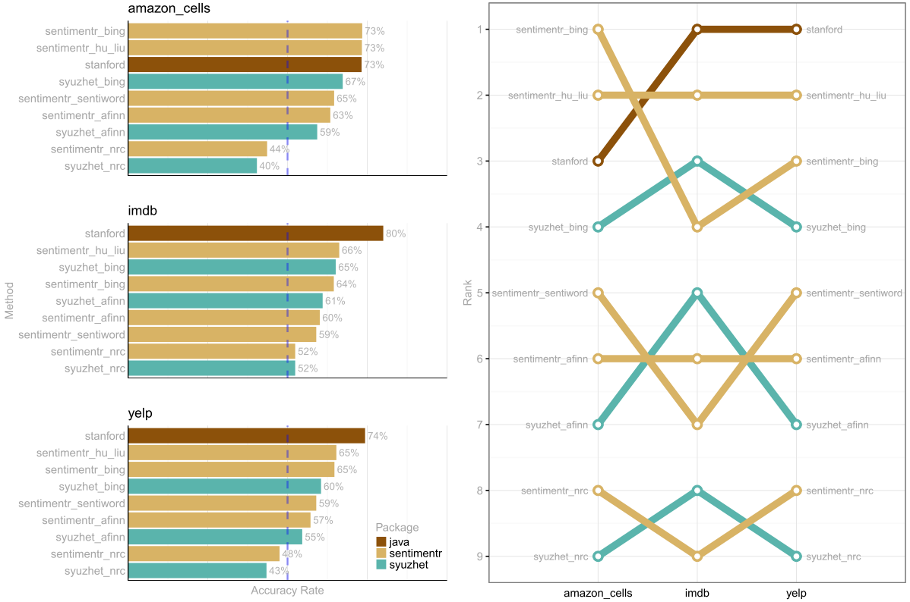
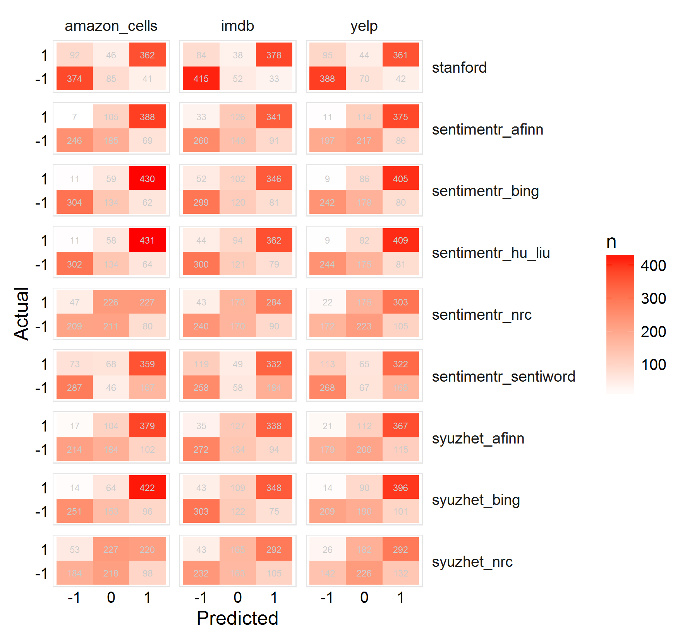
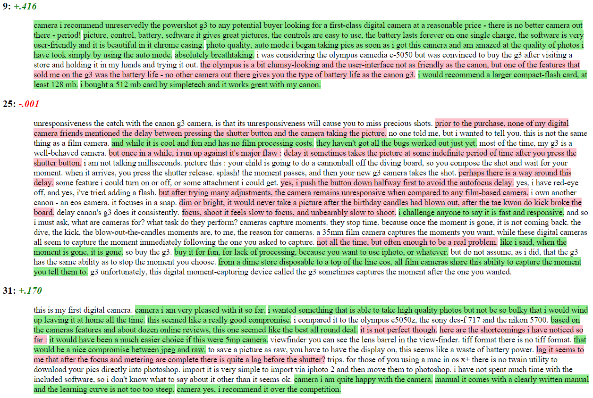

sentimentr
============

**sentimentr** is designed to quickly calculate text polarity sentiment
at the sentence level and optionally aggregate by rows or grouping
variable(s).

**sentimentr** is a response to my own needs with sentiment detection
that were not addressed by the current **R** tools. My own `polarity`
function in the **qdap** package is slower on larger data sets. It is a
dictionary lookup approach that tries to incorporate weighting for
valence shifters (negation and amplifiers/deamplifiers). Matthew
Jocker's created the
[**syuzhet**](http://www.matthewjockers.net/2015/02/02/syuzhet/) package
that utilizes dictionary lookups for the Bing, NRC, and Afinn methods.
He also utilizes a wrapper for the [Stanford
coreNLP](http://nlp.stanford.edu/software/corenlp.shtml) which uses much
more sophisticated analysis. Jocker's dictionary methods are fast but
are more prone to error in the case of valence shifters. Jocker's
[addressed these
critiques](http://www.matthewjockers.net/2015/03/04/some-thoughts-on-annies-thoughts-about-syuzhet/)
explaining that the method is good with regard to analyzing general
sentiment in a piece of literature. He points to the accuracy of the
Stanford detection as well. In my own work I need better accuracy than a
simple dictionary lookup; something that considers valence shifters yet
optimizes speed which the Stanford's parser does not. This leads to a
trade off of speed vs. accuracy. The equation below describes the
dictionary method of **sentimentr** that may give better results than a
dictionary approach that does not consider valence shifters but will
likely still be less accurate than Stanford's approach. Simply,
**sentimentr** attempts to balance accuracy and speed.

Table of Contents
============

-   [[Functions](#functions)](#[functions](#functions))
-   [[The Equation](#the-equation)](#[the-equation](#the-equation))
-   [[Installation](#installation)](#[installation](#installation))
-   [[Examples](#examples)](#[examples](#examples))
    -   [[Plotting](#plotting)](#[plotting](#plotting))
        -   [[Plotting at Aggregated Sentiment](#plotting-at-aggregated-sentiment)](#[plotting-at-aggregated-sentiment](#plotting-at-aggregated-sentiment))
        -   [[Plotting at the Sentence Level](#plotting-at-the-sentence-level)](#[plotting-at-the-sentence-level](#plotting-at-the-sentence-level))
    -   [[Annie Swafford's Examples](#annie-swaffords-examples)](#[annie-swafford's-examples](#annie-swaffords-examples))
    -   [[Comparing sentimentr, syuzhet, and Stanford](#comparing-sentimentr-syuzhet-and-stanford)](#[comparing-sentimentr-syuzhet-and-stanford](#comparing-sentimentr-syuzhet-and-stanford))
    -   [[Text Highlighting](#text-highlighting)](#[text-highlighting](#text-highlighting))
-   [[Contact](#contact)](#[contact](#contact))

Functions
============

There are two main functions (top 2 in table below) in **sentimentr**
with several helper functions summarized in the table below:

<table style="width:104%;">
<colgroup>
<col width="26%" />
<col width="77%" />
</colgroup>
<thead>
<tr class="header">
<th align="left">Function</th>
<th align="left">Description</th>
</tr>
</thead>
<tbody>
<tr class="odd">
<td align="left"><code>sentiment</code></td>
<td align="left">Sentiment at the sentence level</td>
</tr>
<tr class="even">
<td align="left"><code>sentiment_by</code></td>
<td align="left">Aggregated sentiment by group(s)</td>
</tr>
<tr class="odd">
<td align="left"><code>uncombine</code></td>
<td align="left">Extract sentence level sentiment from <code>sentiment_by</code></td>
</tr>
<tr class="even">
<td align="left"><code>get_sentences</code></td>
<td align="left">Regex based string to sentence parser (or get sentences from <code>sentiment</code>/<code>sentiment_by</code>)</td>
</tr>
<tr class="odd">
<td align="left"><code>replace_emoticon</code></td>
<td align="left">Replace emoticons with word equivalent</td>
</tr>
<tr class="even">
<td align="left"><code>replace_rating</code></td>
<td align="left">Replace ratings (e.g., &quot;10 out of 10&quot;, &quot;3 stars&quot;) with word equivalent</td>
</tr>
<tr class="odd">
<td align="left"><code>as_key</code></td>
<td align="left">Coerce a <code>data.frame</code> lexicon to a polarity hash key</td>
</tr>
<tr class="even">
<td align="left"><code>is_key</code></td>
<td align="left">Check if an object is a hash key</td>
</tr>
<tr class="odd">
<td align="left"><code>update_key</code></td>
<td align="left">Add/remove terms to/from a hash key</td>
</tr>
<tr class="even">
<td align="left"><code>highlight</code></td>
<td align="left">Highlight positive/negative sentences as an HTML document</td>
</tr>
</tbody>
</table>

The Equation
============

The equation used by the algorithm to assign value to polarity of each
sentence fist utilizes the sentiment dictionary (Hu and Liu,
[2004](http://www.cs.uic.edu/~liub/publications/kdd04-revSummary.pdf))
to tag polarized words. Each paragraph
(*p**i* = {*s*1, *s*2, ..., *s**n*})
composed of sentences, is broken into element sentences
(*s**i*, *j* = {*w*1, *w*2, ..., *w**n*})
where *w* are the words within sentences. Each sentence
(*s**j*) is broken into a an ordered bag of words.
Punctuation is removed with the exception of pause punctuations (commas,
colons, semicolons) which are considered a word within the sentence. I
will denote pause words as *c**w* (comma words) for convenience. We can
represent these words as an i,j,k notation as
*w**i*, *j*, *k*. For example *w*3, 2, 5 would be
the fifth word of the second sentence of the third paragraph. While I
use the term paragraph this merely represent a complete turn of talk.
For example it may be a cell level response in a questionnaire composed
of sentences.

The words in each sentence (*w**i*, *j*, *k*) are searched
and compared to a modified version of Hu, M., & Liu, B.'s (2004)
dictionary of polarized words. Positive
(*w**i*, *j*, *k*+) and negative
(*w**i*, *j*, *k*−) words are tagged with a +1 and
−1 respectively (or other positive/negative weighting if the user
provides the sentiment dictionary). I will denote polarized words as
*p**w* for convenience. These will form a polar cluster
(*c**i*, *j*, *l*) which is a subset of the a sentence
(*c**i*, *j*, *l* ⊆ *s**i*, *j*).

The polarized context cluster (*c**i*, *j*, *l*) of words is
pulled from around the polarized word (*p**w*) and defaults to 4 words
before and two words after *p**w* to be considered as valence shifters.
The cluster can be represented as
(*c**i*, *j*, *l* = {*p**w**i*, *j*, *k* − *n**b*, ..., *p**w**i*, *j*, *k*, ..., *p**w**i*, *j*, *k* − *n**a*}),
where *n**b* & *n**a* are the parameters `n.before` and `n.after` set by
the user. The words in this polarized context cluster are tagged as
neutral (*w**i*, *j*, *k*0), negator
(*w**i*, *j*, *k**n*), amplifier
(*w**i*, *j*, *k**a*), or de-amplifier
(*w**i*, *j*, *k**d*). Neutral words hold no value
in the equation but do affect word count (*n*). Each polarized word is
then weighted (*w*) based on the weights from the `polarity_dt` argument
and then further weighted by the function and number of the valence
shifters directly surrounding the positive or negative word (*p**w*).
Pause (*c**w*) locations (punctuation that denotes a pause including
commas, colons, and semicolons) are indexed and considered in
calculating the upper and lower bounds in the polarized context cluster.
This is because these marks indicate a change in thought and words prior
are not necessarily connected with words after these punctuation marks.
The lower bound of the polarized context cluster is constrained to
max{*p**w**i*, *j*, *k* − *n**b*, 1, max{*c**w**i*, *j*, *k* &lt; *p**w**i*, *j*, *k*}}
and the upper bound is constrained to
min{*p**w**i*, *j*, *k* + *n**a*, *w**i*, *j**n*, min{*c**w**i*, *j*, *k* &gt; *p**w**i*, *j*, *k*}}
where *w**i*, *j**n* is the number of words in the sentence.

The core value in the cluster, the polarized word is acted upon by
valence shifters. Amplifiers increase the polarity by 1.8 (.8 is the
default weight (*z*)). Amplifiers
(*w**i*, *j*, *k**a*) become de-amplifiers if the
context cluster contains an odd number of negators
(*w**i*, *j*, *k**n*). De-amplifiers work to
decrease the polarity. Negation
(*w**i*, *j*, *k**n*) acts on
amplifiers/de-amplifiers as discussed but also flip the sign of the
polarized word. Negation is determined by raising −1 to the power of the
number of negators (*w**i*, *j*, *k**n*) plus 2.
Simply, this is a result of a belief that two negatives equal a
positive, 3 negatives a negative, and so on.

The "but" conjunctions (i.e., 'but', 'however', and 'although') also
weight the context cluster. A but conjunction before the polarized word
(*w**b**u**t* *c**o**n**j**u**n**c**t**i**o**n*, ..., *w**i*, *j*, *k**p*)
up-weights the cluster by 1 +
*z*2 \* {|*w**b**u**t* *c**o**n**j**u**n**c**t**i**o**n*|,...,*w**i*, *j*, *k**p*}
(.85 is the default weight (*z*2) where
|*w**b**u**t* *c**o**n**j**u**n**c**t**i**o**n*| are the
number of but conjunctions before the polarized word). A but conjunction
after the polarized word down-weights the cluster by 1 +
{*w**i*, *j*, *k**p*, ..., |*w**b**u**t* *c**o**n**j**u**n**c**t**i**o**n*|\* − 1}\**z*2.
This corresponds to the belief that a but makes the next clause of
greater values while lowering the value placed on the prior clause.

The researcher may provide a weight (*z*) to be utilized with
amplifiers/de-amplifiers (default is .8; de-amplifier weight is
constrained to −1 lower bound). Last, these weighted context clusters
(*c**i*, *j*, *l*) are summed (*c*′*i*, *j*) and
divided by the square root of the word count
(&radic;*w**i*, *j**n*) yielding an unbounded polarity score
(*δ**i*, *j*) for each sentence.

*δ**i**j* =
<em>c</em>'*i**j*/&radic;*w**i**j**n*

Where:

*c*′*i*, *j* = ∑((1 + *w**a**m**p* + *w**d**e**a**m**p*)⋅*w**i*, *j*, *k**p*(−1)2 + *w**n**e**g*)

*w**a**m**p* = ∑(*w**n**e**g* ⋅ (*z* ⋅ *w**i*, *j*, *k**a*))

*w**d**e**a**m**p* = max(*w**d**e**a**m**p*′, −1)

*w**d**e**a**m**p*′ = ∑(*z*(−*w**n**e**g* ⋅ *w**i*, *j*, *k**a* + *w**i*, *j*, *k**d*))

*w**b* = 1 + *z*2 \* *w**b*′

*w**b*′ = ∑(|*w**b**u**t* *c**o**n**j**u**n**c**t**i**o**n*|,...,*w**i*, *j*, *k**p*, *w**i*, *j*, *k**p*, ..., |*w**b**u**t* *c**o**n**j**u**n**c**t**i**o**n*|\* − 1)

*w**n**e**g* = (∑*w**i*, *j*, *k**n* )
mod 2

To get the mean of all sentences (*s**i*, *j*) within a
paragraph (*p**i*) simply take the average sentiment score
*p**i*, *δ**i*, *j* = 1/n ⋅ ∑
*δ**i*, *j*.

Installation
============

To download the development version of **sentimentr**:

Download the [zip
ball](https://github.com/trinker/sentimentr/zipball/master) or [tar
ball](https://github.com/trinker/sentimentr/tarball/master), decompress
and run `R CMD INSTALL` on it, or use the **pacman** package to install
the development version:

    if (!require("pacman")) install.packages("pacman")
    pacman::p_load_gh("trinker/sentimentr")

Examples
========

    if (!require("pacman")) install.packages("pacman")
    pacman::p_load(sentimentr)

    mytext <- c(
        'do you like it?  But I hate really bad dogs',
        'I am the best friend.',
        'Do you really like it?  I\'m not a fan'
    )
    sentiment(mytext)

    ##    element_id sentence_id word_count  sentiment
    ## 1:          1           1          4  0.5000000
    ## 2:          1           2          6 -2.6781088
    ## 3:          2           1          5  0.4472136
    ## 4:          3           1          5  0.8049845
    ## 5:          3           2          4  0.0000000

To aggregate by element (column cell or vector element) use
`sentiment_by` with `by = NULL`.

    mytext <- c(
        'do you like it?  But I hate really bad dogs',
        'I am the best friend.',
        'Do you really like it?  I\'m not a fan'
    )
    sentiment_by(mytext)

    ##    element_id word_count       sd ave_sentiment
    ## 1:          1         10 2.247262    -1.0890544
    ## 2:          2          5       NA     0.4472136
    ## 3:          3          9 0.569210     0.4024922

To aggregate by grouping variables use `sentiment_by` using the `by`
argument.

    (out <- with(presidential_debates_2012, sentiment_by(dialogue, list(person, time))))

    ##        person   time word_count        sd ave_sentiment
    ##  1:     OBAMA time 1       3598 0.4397446    0.10837955
    ##  2:    LEHRER time 1        765 0.3504484    0.10580101
    ##  3:     OBAMA time 3       7241 0.4116071    0.09651532
    ##  4:     OBAMA time 2       7476 0.3834887    0.08935680
    ##  5:    ROMNEY time 3       8302 0.3930657    0.07942057
    ##  6:    ROMNEY time 1       4085 0.3510203    0.06657421
    ##  7: SCHIEFFER time 3       1445 0.3772378    0.06515716
    ##  8:   CROWLEY time 2       1672 0.2125288    0.05531121
    ##  9:    ROMNEY time 2       7534 0.3220190    0.04535011
    ## 10:  QUESTION time 2        583 0.3255268    0.03334828

Plotting
--------

### Plotting at Aggregated Sentiment

    plot(out)

  

### Plotting at the Sentence Level

The `plot` method for the class `sentiment` uses **syuzhet**'s
`get_transformed_values` combined with **ggplot2** to make a reasonable,
smoothed plot for the duration of the text based on percentage, allowing
for comparison between plots of different texts. This plot gives the
overall shape of the text's sentiment. The user can see
`syuzhet::get_transformed_values` for more details.

    plot(uncombine(out))

  

Annie Swafford's Examples
-------------------------

[Annie
Swafford](https://annieswafford.wordpress.com/2015/03/02/syuzhet/)
critiqued Jocker's approach to sentiment and gave the following examples
of sentences (`ase` for Annie Swafford example). Here I test each of
Jocker's 3 dictionary approaches (Bing, NRC, Afinn), his Stanford
wrapper (note I use my own [GitHub Stanford wrapper
package](https://github.com/trinker/stansent) based off of Jocker's
approach as it works more reliably on my own Windows machine), and my
own algorithm with both the default [Hu & Liu
(2004)](https://www.aaai.org/Papers/AAAI/2004/AAAI04-119.pdf) polarity
lexicon as well as [Baccianella, Esuli and Sebastiani's
(2010)](http://sentiwordnet.isti.cnr.it/) SentiWord lexicon.

    if (!require("pacman")) install.packages("pacman")
    pacman::p_load_gh("trinker/sentimentr", "trinker/stansent")
    pacman::p_load(syuzhet, qdap, microbenchmark)

    ase <- c(
        "I haven't been sad in a long time.",
        "I am extremely happy today.",
        "It's a good day.",
        "But suddenly I'm only a little bit happy.",
        "Then I'm not happy at all.",
        "In fact, I am now the least happy person on the planet.",
        "There is no happiness left in me.",
        "Wait, it's returned!",
        "I don't feel so bad after all!"
    )

    syuzhet <- setNames(as.data.frame(lapply(c("bing", "afinn", "nrc"),
        function(x) get_sentiment(ase, method=x))), c("bing", "afinn", "nrc"))

    left_just(data.frame(
        stanford = sentiment_stanford(ase)[["sentiment"]],
        hu_liu = round(sentiment(ase, question.weight = 0)[["sentiment"]], 2),
        sentiword = round(sentiment(ase, sentiword, question.weight = 0)[["sentiment"]], 2),    
        syuzhet,
        sentences = ase,
        stringsAsFactors = FALSE
    ), "sentences")

      stanford hu_liu sentiword bing afinn nrc
    1     -0.5      0      0.27   -1    -2   0
    2        1    0.8      0.65    1     3   1
    3      0.5    0.5      0.32    1     3   1
    4     -0.5      0         0    1     3   1
    5     -0.5  -0.41     -0.56    1     3   1
    6     -0.5   0.06      0.05    1     3   1
    7     -0.5  -0.38     -0.05    1     2   1
    8        0      0     -0.14    0     0  -1
    9     -0.5   0.38      0.24   -1    -3  -1
      sentences                                              
    1 I haven't been sad in a long time.                     
    2 I am extremely happy today.                            
    3 It's a good day.                                       
    4 But suddenly I'm only a little bit happy.              
    5 Then I'm not happy at all.                             
    6 In fact, I am now the least happy person on the planet.
    7 There is no happiness left in me.                      
    8 Wait, it's returned!                                   
    9 I don't feel so bad after all!                         

Also of interest is the computational time used by each of these
methods. To demonstrate this I increased Annie's examples by 100
replications and **microbenchmark** on a few iterations (Stanford takes
so long I didn't extend to more). Note that if a text needs to be broken
into sentence parts **syuzhet** has the `get_sentences` function that
uses the **openNLP** package, this is a time expensive task.
**sentimentr** uses a much faster regex based approach that is nearly as
accurate in parsing sentences with a much lower computational time. We
see that Stanford takes the longest time while **sentimentr** and
**syuzhet** are comparable depending upon lexicon used.

    ase_100 <- rep(ase, 100)

    stanford <- function() {sentiment_stanford(ase_100)}

    sentimentr_hu_liu <- function() sentiment(ase_100)
    sentimentr_sentiword <- function() sentiment(ase_100, sentiword) 
        
    syuzhet_binn <- function() get_sentiment(ase_100, method="bing")
    syuzhet_nrc <- function() get_sentiment(ase_100, method="nrc")
    syuzhet_afinn <- function() get_sentiment(ase_100, method="afinn")
         
    microbenchmark(
        stanford(),
        sentimentr_hu_liu(),
        sentimentr_sentiword(),
        syuzhet_binn(), 
        syuzhet_nrc(),
        syuzhet_afinn(),
        times = 3
    )

    Unit: milliseconds
                       expr        min         lq       mean     median
                 stanford() 24434.7906 25698.1308 26128.3359 26961.4710
        sentimentr_hu_liu()   251.1763   251.3880   267.9926   251.5996
     sentimentr_sentiword()  1015.0445  1015.6492  1042.5035  1016.2540
             syuzhet_binn()   343.5851   349.6782   351.7873   355.7714
              syuzhet_nrc()   844.1486   854.7963   868.1705   865.4441
            syuzhet_afinn()   159.9836   161.5619   203.5712   163.1403
             uq        max neval
     26975.1085 26988.7461     3
       276.4007   301.2019     3
      1056.2330  1096.2121     3
       355.8884   356.0054     3
       880.1815   894.9189     3
       225.3650   287.5898     3

Comparing sentimentr, syuzhet, and Stanford
-------------------------------------------

The accuracy of an algorithm weighs heavily into the decision as to what
approach to take in sentiment detection. Both **syuzhet** and
**sentimentr** provide multiple dictionaries with a general algorithm to
compute sentiment scores. **syuzhet** provides 3 approaches while
**sentimentr** provides 2, but can be extended easily using the 3
dictionaries from the **syuzhet** package. The follow visualization
provides the accuracy of these approaches in comparison to Stanford's
**Java** based implementation of sentiment detection. The visualization
is generated from testing on three reviews data sets from Kotzias,
Denil, De Freitas, & Smyth (2015). These authors utilized the three 1000
element data sets from:

-   amazon.com
-   imdb.com
-   yelp.com

The data sets are hand scored as either positive or negative. The
testing here merely matches the sign of the algorithm to the human coded
output to determine accuracy rates.

-   Kotzias, D., Denil, M., De Freitas, N., & Smyth,P. (2015). *From
    group to individual labels using deep features*. Proceedings of the
    21th ACM SIGKDD International Conference on Knowledge Discovery and
    Data Mining. 597-606.
    <http://mdenil.com/media/papers/2015-deep-multi-instance-learning.pdf>

The bar graph on the left shows the accuracy rates for the various
sentiment set-ups in the three review contexts. The rank plot on the
right shows how the rankings for the methods varied across the three
review contexts (note that rank ties were determined by
`ties.method = "first"`).

The take away here seems that, unsurprisingly, Stanford's algorithm
consistently out scores **syuzhet** and **sentimentr**. The
**sentimentr** approach loaded with the `hu_lu` dictionary is a top pick
for speed and accuracy. The `bing` dictionary also performs well within
both the **syuzhet** and **sentimentr** algorithms. Generally, the
**sentimentr** algorithm out performs **syuzhet** when their dictonaries
are comparable.

It is important to point out that this is a small sample data set that
covers a narrow range of uses for sentiment detection. Jocker's
**syuzhet** was designed to be applied across book chunks and it is, to
some extent, unfair to test it out of this context. Still this initial
analysis provides a guide that may be of use for selecting the sentiment
detection set up most applicable to the reader's needs.

The reader may access the R script used to generate this visual via:

    testing <- system.file("sentiment_testing/sentiment_testing.R", package = "sentimentr")
    file.copy(testing, getwd())

In the figure below we compare raw table counts as a heat map, plotting
the predicted values from the various algorithms on the x axis versus
the human scored values on the y axis.

Across all three contexts, notice that the Stanford coreNLP algorithm is
better at:

-   Detecting negative sentiment as negative
-   Discrimination (i.e., reducing neutral assignments)

The Bing, Hu & Lu, and Afinn dictionaries all do well with regard to not
assigning negative scores to positive statements, but perform less well
in the reverse, often assigning positive scores to negative statements.
We can now see that the reason for the NRC's poorer performance in
accuracy rate above is its inability to discriminate. The Sentiword
dictionary does well at discriminating (like Stanford's coreNLP) but
does not perform well. We can deduce to things from this observation:

1.  Larger dictionaries discriminate better (Sentiword \[n =
    20,103\] vs. Hu & Lu \[n = 6,821\])
2.  The Sentiword dictionary may have words with reversed polarities

A reworking of the Sentiword dictionary may yield better results for a
dictionary lookup approach to sentiment detection, potentially,
improving on discrimination and accuracy.

The reader may access the R script used to generate this visual via:

    testing2 <- system.file("sentiment_testing/raw_results.R", package = "sentimentr")
    file.copy(testing2, getwd())

Text Highlighting
-----------------

The user may wish to see the output from `sentiment_by` line by line
with positive/negative sentences highlighted. The `highlight` function
wraps a `sentiment_by` output to produces a highlighted HTML file
(positive = green; negative = pink). Here we look at three random
reviews from Hu and Liu's (2004) Cannon G3 Camera Amazon product
reviews.

    set.seed(2)
    highlight(with(subset(cannon_reviews, number %in% sample(unique(number), 3)), sentiment_by(review, number)))

Contact
=======

You are welcome to: 
* submit suggestions and bug-reports at: <https://github.com/trinker/sentimentr/issues> 
* send a pull request on: <https://github.com/trinker/sentimentr/> 
* compose a friendly e-mail to: <tyler.rinker@gmail.com>
